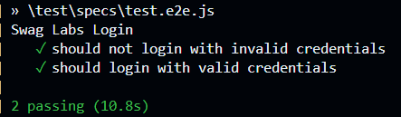
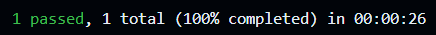
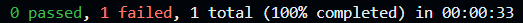

# SwagLabs App Testing

This repository is a testing environment using WebDriverIO and Appium.

## Set up environment
### First make sure you have the following installed:
- Node.js   (Check version with `node -v`)

- npm       (Check version with `npm -v`)

- Appium   (`npm install --save-dev @wdio/appium-service`)

- Android Studio

- An Android Emulator (Check `wdio.conf.js` for the android version)

**Recommended:**
- Git Bash **(I recommend using it instead of `CMD` or `PS`)**

### DON'T USE POWERSHELL (PS)
#

**When running commands, if it asks to install missing components, dlls or things like appium, accept it**.

## Commands (From the Start)

1. Run `npm init wdio` and set everything up
2. 

## Running Tests

1. Create your tests as `/test/**/**.js`

2. Update `wdio.conf.js` `capabilities`, for example:
```js
capabilities: [{
    // capabilities for local Appium web tests on an Android Emulator
    platformName: 'Android',
    'appium:deviceName': 'Android GoogleAPI Emulator',
    'appium:platformVersion': '11.0', // <-- Update it to match the version you are using
    'appium:automationName': 'UiAutomator2',
    'appium:app': 'Path\\To\\Your\\App.apk',
    'appium:appWaitActivity': '*',
    'appium:autoGrantPermissions': true // <-- Optional, grants all permissions
}],
```

3. Start the emulator.

4. Run your tests using `npx wdio run wdio.conf.js`

### What a good test looks like
**Check `test/specs/test.e2e.js` for the documented code.
```js
describe('Swag Labs Login', () => {
    it('should not login with invalid credentials', async () => {
        await $('~test-Username').setValue('invalid_user')
        await $('~test-Password').setValue('invalid_password')
        await $('~test-LOGIN').click()
        await expect($('~test-PRODUCTS')).not.toBeDisplayed()
    })

    it('should login with valid credentials', async () => {
        await $('~test-Username').setValue('standard_user')
        await $('~test-Password').setValue('secret_sauce')
        await $('~test-LOGIN').click()
        await expect($('~test-PRODUCTS')).toBeDisplayed()
    });
})
```






### What a bad test looks like
**REMINDER:** The following shows the result of a fail on **purpose**!




## Commands that may help
### If you have issues while running `npx wdio run wdio.conf.js`:
You should try to run the following command:
- `appium driver install uiautomator2`

If it doesn't work, run this one and then try the previous one again:
- `npm install --save-dev @wdio/appium-service appium`
